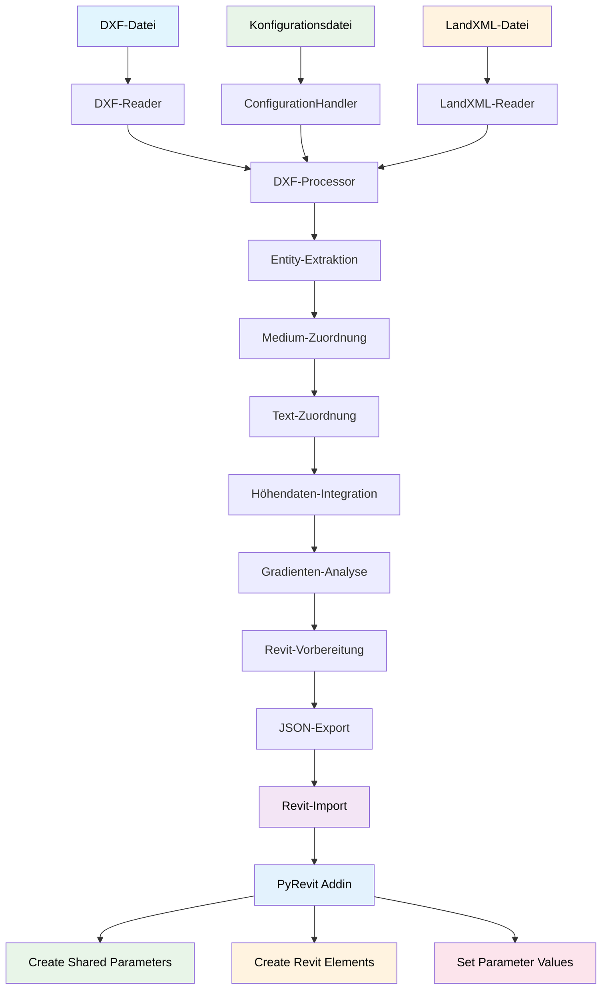
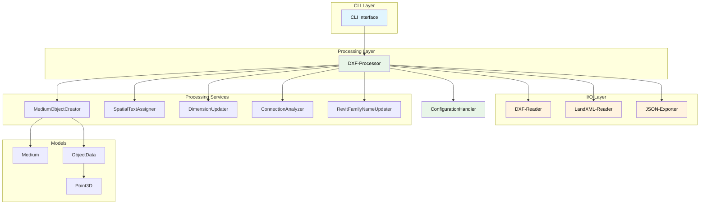

# pymto - DXF Processing Tool for Revit Export

[](https://www.python.org/downloads/)
[](https://github.com/astral-sh/uv)

Ein Python-Tool zur Verarbeitung von DXF-Dateien mit Rohrleitungen und Schächten für den Export nach Revit. Das Tool extrahiert Geometrieinformationen, gruppiert Elemente nach Medien und exportiert die Daten in ein Revit-kompatibles JSON-Format.

## Inhaltsverzeichnis

- [Features](#features)
- [Installation](#installation)
- [Entwicklersetup](#entwicklersetup)
- [Verwendung](#verwendung)
  - [Grundlegende Verwendung](#grundlegende-verwendung)
  - [Erweiterte Optionen](#erweiterte-optionen)
  - [Konfigurationsdateien](#konfigurationsdateien)
- [Verarbeitungsschritte](#verarbeitungsschritte)
  - [Datenfluss-Diagramm](#datenfluss-diagramm)
  - [Architektur-Diagramm](#architektur-diagramm)
- [Projektstruktur](#projektstruktur)
- [Entwicklung](#entwicklung)
- [Architektur](#architektur)
- [Beispiele](#beispiele)
- [API Dokumentation](#api-dokumentation)
- [Detaillierte API Referenz](docs/API.md)

## Features

- **DXF-Dateien verarbeiten**: Extraktion von Rohrleitungen, Schächten und Textelementen
- **LandXML-Integration**: Höhenangaben aus DGM-Daten übernehmen
- **Flexible Gruppierung**: Layer-basiert oder farbbasiert
- **Textzuordnung**: Räumliche oder zonenbasierte Zuordnung von Texten zu Rohrleitungen
- **Revit-Export**: JSON-Format optimiert für Revit-Import
- **CLI-Interface**: Benutzerfreundliche Kommandozeilen-Schnittstelle
- **Modulare Architektur**: SOLID-Prinzipien und austauschbare Strategien

## Installation

### Voraussetzungen

- Python 3.10 oder höher
- [uv](https://docs.astral.sh/uv/) Package Manager

### Installation mit uv

```bash
# Repository klonen
git clone <repository-url>
cd pymto

# Virtual Environment erstellen und Dependencies installieren
uv sync

# Tool testen
uv run python -m pymto.cli --help
```

### Alternative Installation (pip)

```bash
# Virtual Environment erstellen
python -m venv venv
source venv/bin/activate  # Linux/macOS
# oder
venv\Scripts\activate  # Windows

# Dependencies installieren
pip install -e .
```

## Entwicklersetup

### Mit uv (empfohlen)

```bash
# Entwicklungsumgebung einrichten
uv sync --dev

# Code-Qualität Tools
uv run ruff check          # Linting
uv run ruff format         # Code-Formatierung
uv run isort .             # Import-Sortierung
uv run pyright            # Type-Checking

# Tests ausführen
uv run pytest             # Alle Tests
uv run pytest tests/      # Spezifisches Verzeichnis
uv run pytest -v          # Verbose Output
```

### Pre-commit Hooks (optional)

```bash
# Pre-commit installieren
uv add --dev pre-commit

# Hooks einrichten
uv run pre-commit install

# Manuell ausführen
uv run pre-commit run --all-files
```

## Verwendung

### Grundlegende Verwendung

```bash
# Grundlegende DXF-Verarbeitung mit allen erforderlichen Parametern
uv run python -m pymto.cli process-dxf input.dxf config.json terrain.xml

# Mit Output-Datei spezifizieren
uv run python -m pymto.cli process-dxf input.dxf config.json terrain.xml --output output.json

# Mit Gradient-Anpassung
uv run python -m pymto.cli process-dxf input.dxf config.json terrain.xml --adjust-gradient

# Verbose Output
uv run python -m pymto.cli process-dxf input.dxf config.json terrain.xml --verbose
```

### Erweiterte Process Optionen

```bash
# Mit angepasster Textdistanz
uv run python -m pymto.cli process-dxf input.dxf config.json terrain.xml \
  --max-text-distance 30.0

# Vollständiges Beispiel mit allen Optionen
uv run python -m pymto.cli process-dxf input.dxf config.json terrain.xml \
  --output output.json \
  --max-text-distance 30.0 \
  --adjust-gradient \
  --verbose
```

### Konfigurationsdateien

#### Sample-Konfiguration erstellen

```bash
# Beispiel-Konfiguration generieren
uv run python -m pymto.cli create-config sample_config.json

# Mit DXF-Datei für automatische Layererkennung
uv run python -m pymto.cli create-config sample_config.json --dxf-file input.dxf
```

#### Konfigurationsformat (Aktuell)

```json
{
  "Abwasserleitung": {
    "Leitung": [{
      "Unit": "mm",
      "Category": "water",
      "Family": "Pipe-Family",
      "FamilyType": "Pipe-Type",
      "Geometrie": [{
        "Name": "PIPE_SEWER",
        "Farbe": [255, 0, 0]
      }],
      "Text": [{
        "Name": "TEXT_PIPE_DIMENSION"
      }]
    }],
    "Element": [{
      "Unit": "mm",
      "Category": "water",
      "Family": "Shaft-Family",
      "FamilyType": "Shaft-Type",
      "Geometrie": [{
        "Name": "SHAFT_SEWER",
        "Farbe": [200, 0, 0]
      }],
      "Text": [{
        "Name": "TEXT_SEWER",
        "Farbe": [255, 100, 100]
      }]
    }]
  }
}
```

### Detaillierte Konfigurationsstruktur

Die Konfigurationsdatei definiert, wie DXF-Entities zu Medien gruppiert und verarbeitet werden. Jedes Medium kann sowohl **Element** (punkt-basierte Objekte wie Schächte) als auch **Leitung** (linien-basierte Objekte wie Rohrleitungen) enthalten.

#### Grundstruktur

```json
{
  "MediumName": {
    "Element": [MediumConfig],
    "Leitung": [MediumConfig]
  }
}
```

#### MediumConfig Felder

Jede Konfiguration (`MediumConfig`) definiert eine Gruppe von verwandten DXF-Objekten:

| Feld              | Typ      | Erforderlich | Beschreibung                   | Verwendung                                                                                                   |
|-------------------|----------|--------------|--------------------------------|--------------------------------------------------------------------------------------------------------------|
| `Unit`            | `string` | Ja           | Maßeinheit für Dimensionen     | Unterstützt: `"mm"`, `"cm"`, `"m"`<br/>Standard: `"mm"`                                                      |
| `Category`        | `string` | Ja           | Objektkategorie für Revit      | Werte: `"water"`, `"waste_water"`, `"gas"`, `"telecom"`, etc.<br/>Siehe [ObjectType Enum](#objecttype-werte) |
| `Family`          | `string` | Ja           | Revit Family Name              | Wird für Revit-Export verwendet                                                                              |
| `FamilyType`      | `string` | Ja           | Revit Family Type Name         | Wird für Revit-Export verwendet                                                                              |
| `FDK_ID`          | `string` | Nein         | Eindeutige Objekt-ID           | Standard: `"UNKNOWN"`                                                                                        |
| `ElevationOffset` | `number` | Nein         | Höhenoffset in Metern          | Standard: `0.0`                                                                                              |
| `DefaultWidth`    | `number` | Nein         | Standard-Breite in Metern      | Für rechteckige Objekte                                                                                      |
| `DefaultDepth`    | `number` | Nein         | Standard-Tiefe in Metern       | Für rechteckige Objekte                                                                                      |
| `DefaultHeight`   | `number` | Nein         | Standard-Höhe in Metern        | Für alle Objekte                                                                                             |
| `DefaultDiameter` | `number` | Nein         | Standard-Durchmesser in Metern | Für runde Objekte                                                                                            |
| `Geometrie`       | `array`  | Ja           | Liste der Geometrie-Layer      | Siehe [LayerData Struktur](#layerdata-struktur)                                                              |
| `Text`            | `array`  | Ja           | Liste der Text-Layer           | Siehe [LayerData Struktur](#layerdata-struktur)                                                              |

#### LayerData Struktur

Definiert, welche DXF-Layer und Farben zu einer Konfiguration gehören:

| Feld    | Typ                   | Erforderlich | Beschreibung        | Beispiele                                   |
|---------|-----------------------|--------------|---------------------|---------------------------------------------|
| `Name`  | `string`              | Nein*        | DXF Layer-Name      | `"PIPE_WATER"`, `"SHAFT_SEWER"`             |
| `Farbe` | `string/array/number` | Nein         | Farbe für Filterung | Siehe [Farbdefinitionen](#farbdefinitionen) |
| `Block` | `string`              | Nein*        | DXF Block-Name      | `"SCHACHT_RUND"`, `"MANHOLE_600"`           |

*Mindestens `Name` oder `Block` muss angegeben werden.

#### Farbdefinitionen

Farben können auf verschiedene Weise definiert werden:

```json
{
  "Farbe": [255, 0, 0]        // RGB-Array (rot)
  "Farbe": 1                  // ACI-Farbnummer (rot)
  "Farbe": "ROT"              // Deutsche Farbname
  "Farbe": "RED"              // Englische Farbname
  "Farbe": "Farbe 15"         // AutoCAD Farbbezeichnung
}
```

**Unterstützte Farbnamen:**

- Deutsch: `ROT`, `BLAU`, `GRÜN`, `GELB`, `CYAN`, `MAGENTA`, `WEISS`, `SCHWARZ`, `GRAU`, `HELLGRAU`
- Englisch: `RED`, `BLUE`, `GREEN`, `YELLOW`, `CYAN`, `MAGENTA`, `WHITE`, `BLACK`, `GRAY`, `LIGHTGRAY`

#### ObjectType Werte

Verfügbare Kategorien für das `Category` Feld:

| Wert                    | Beschreibung            | Verwendung                      |
|-------------------------|-------------------------|---------------------------------|
| `"water"`               | Wasserleitung           | Rohrleitungen und Armaturen     |
| `"waste_water"`         | Abwasserleitung         | Kanalisations-Infrastruktur     |
| `"shaft"`               | Schacht                 | Einstiegs- und Kontrollschächte |
| `"gas"`                 | Gasleitung              | Gas-Infrastruktur               |
| `"telecom"`             | Telekommunikation       | Kabel und Verteilerkästen       |
| `"cable_duct"`          | Kabelkanal              | Elektro-Infrastruktur           |
| `"lighting"`            | Beleuchtung             | Straßenbeleuchtung              |
| `"hydrant"`             | Hydrant                 | Feuerwehr-Infrastruktur         |
| `"gate_value"`          | Schieber                | Absperrarmaturen                |
| `"water_special"`       | Wasser Spezialbauwerk   | Sonderbauten Wasser             |
| `"waste_water_special"` | Abwasser Spezialbauwerk | Sonderbauten Abwasser           |
| `"distribution_board"`  | Verteilerkasten         | Elektroverteilung               |

#### Vollständiges Konfigurationsbeispiel

```json
{
  "Abwasserleitung": {
    "Leitung": [{
      "Unit": "mm",
      "Category": "waste_water",
      "Family": "Pipe-Abwasser-Family",
      "FamilyType": "Standard-Rohr",
      "FDK_ID": "AW_PIPE_001",
      "ElevationOffset": -0.5,
      "DefaultDiameter": 0.3,
      "Geometrie": [{
        "Name": "PIPE_SEWER",
        "Farbe": [139, 69, 19]
      }, {
        "Name": "PIPE_SEWER_MAIN",
        "Farbe": "BRAUN"
      }],
      "Text": [{
        "Name": "TEXT_PIPE_DIMENSION",
        "Farbe": [255, 255, 255]
      }]
    }],
    "Element": [{
      "Unit": "mm",
      "Category": "shaft",
      "Family": "Shaft-Abwasser-Family",
      "FamilyType": "Normschacht",
      "FDK_ID": "AW_SHAFT_001",
      "DefaultWidth": 1.0,
      "DefaultDepth": 1.0,
      "DefaultHeight": 2.0,
      "Geometrie": [{
        "Name": "SHAFT_SEWER",
        "Farbe": [200, 0, 0]
      }, {
        "Block": "SCHACHT_RECHTECKIG",
        "Farbe": 1
      }],
      "Text": [{
        "Name": "TEXT_SHAFT_ID"
      }]
    }]
  },
  "Wasserleitung": {
    "Leitung": [{
      "Unit": "mm",
      "Category": "water",
      "Family": "Pipe-Wasser-Family",
      "FamilyType": "Trinkwasser-Rohr",
      "FDK_ID": "W_PIPE_001",
      "DefaultDiameter": 0.15,
      "Geometrie": [{
        "Name": "PIPE_WATER",
        "Farbe": [0, 0, 255]
      }],
      "Text": [{
        "Name": "TEXT_WATER_PRESSURE"
      }]
    }],
    "Element": [{
      "Unit": "mm",
      "Category": "hydrant",
      "Family": "Hydrant-Family",
      "FamilyType": "Oberflur-Hydrant",
      "FDK_ID": "W_HYDRANT_001",
      "DefaultDiameter": 0.8,
      "DefaultHeight": 1.2,
      "Geometrie": [{
        "Block": "HYDRANT_BLOCK",
        "Farbe": [0, 100, 255]
      }],
      "Text": [{
        "Name": "TEXT_HYDRANT_INFO"
      }]
    }]
  }
}
```

#### Verwendung in der Verarbeitung

1. **Layer-Matching**: DXF-Entities werden basierend auf `Name`, `Farbe` und `Block` gefiltert
2. **Objekt-Erstellung**: `Category` bestimmt den Objekttyp für Revit
3. **Dimensionierung**: `Default*` Werte werden als Fallback verwendet
4. **Parameter-Extraktion**: Texte werden räumlich zugeordnet und als Dimensionen extrahiert
5. **Revit-Export**: `Family` und `FamilyType` werden für Revit-Objekte verwendet
6. **Einheiten-Konvertierung**: `Unit` bestimmt Eingabeeinheit, Export erfolgt in Metern

#### Tipps zur Konfiguration

- **Layer-Namen**: Verwenden Sie konsistente Namenskonventionen
- **Farbkodierung**: Nutzen Sie eindeutige Farben pro Medium
- **Block-Referenzen**: Ideal für standardisierte Objekte wie Schächte
- **Default-Werte**: Wichtig für Objekte ohne Textinformationen
- **FDK_IDs**: Ermöglichen eindeutige Identifikation in Revit

## Verarbeitungsschritte

Das Tool verarbeitet DXF-Dateien in mehreren aufeinander folgenden Schritten:

### 1. Datei-Eingabe und Konfiguration

- **DXF-Datei**: Geometrische Daten (Rohrleitungen, Schächte, Texte)
- **Konfigurationsdatei**: Zuordnungsregeln für Medien und Layer
- **LandXML-Datei**: Höhendaten vom Geländemodell

### 2. Datenextraktion

- **DXF-Reader**: Lädt DXF-Datei und extrahiert Entities
- **Entity-Klassifizierung**: Unterscheidung zwischen Elementen (Schächte) und Linien (Rohrleitungen)
- **Geometrie-Extraktion**: Positions- und Dimensionsdaten

### 3. Medien-Zuordnung

- **Konfiguration-Abhängige Gruppierung**: Zuordnung basierend auf Layer/Farben
- **Medium-Erstellung**: Gruppierung verwandter Elemente (z.B. Abwasserleitung)

### 4. Text-Zuordnung

- **Räumliche Analyse**: Zuordnung von Texten zu nahegelegenen Objekten
- **Dimensions-Änderung**: Extraktion von Rohrdurchmessern aus Texten

### 5. Höhendaten-Integration

- **LandXML-Parser**: Einlesen von Geländehöhen
- **Höhen-Aktualisierung**: Zuweisung von Z-Koordinaten zu Objekten

### 6. Gradienten-Analyse (optional)

- **Shapely-basierte Geometrieanalyse**: Verbindungsanalyse zwischen Objekten
- **Gradient-Normalisierung**: Anpassung der Rohrgefälle

### 7. Revit-Vorbereitung

- **Parameterwerte-Rundung**: Anpassung auf Revit-Standards
- **Family-Name-Zuordnung**: Revit-spezifische Benennung

### 8. JSON-Export

- **Strukturierte Ausgabe**: Revit-kompatibles JSON-Format
- **Exportstatistiken**: Zusammenfassung der verarbeiteten Daten

### Datenfluss-Diagramm



### Architektur-Diagramm



## Projektstruktur

```text
pymto/
├── src/pymto/                # Hauptanwendung
│   ├── __init__.py           # Package-Initialisierung
│   ├── cli.py                # → [CLI Interface](src/pymto/cli.py)
│   ├── main.py               # → [Haupteinstiegspunkt](src/pymto/main.py)
│   ├── models.py             # → [Datenmodelle](src/pymto/models.py)
│   ├── protocols.py          # → [Interface-Definitionen](src/pymto/protocols.py)
│   ├── processor.py          # → [DXF-Processor](src/pymto/processor.py)
│   ├── config.py             # → [Konfiguration](src/pymto/config.py)
│   ├── io/                   # I/O Module
│   │   ├── dxf_reader.py     # → [DXF-Reader](src/pymto/io/dxf_reader.py)
│   │   ├── landxml_reader.py # → [LandXML-Reader](src/pymto/io/landxml_reader.py)
│   │   └── json_exporter.py  # → [JSON-Exporter](src/pymto/io/json_exporter.py)
│   ├── process/              # Verarbeitungsmodule
│   │   ├── assigners.py      # → [Text-Zuordnung](src/pymto/process/assigners.py)
│   │   ├── creator.py        # → [Objekt-Erstellung](src/pymto/process/creator.py)
│   │   ├── factory.py        # → [Objekt-Factory](src/pymto/process/factory.py)
│   │   ├── revit_updater.py  # → [Revit-Updates](src/pymto/process/revit_updater.py)
│   │   └── dimension/        # Dimensionsverarbeitung
│   │       ├── dimension.py
│   │       ├── dimension_extractor.py
│   │       └── dimension_mapper.py
│   └── analyze/              # Analyse-Module
│       ├── connection_analyzer.py
│       ├── connection_analyzer_shapely.py
│       └── compatibilty.py
├── tests/                    # → [Test-Suite](tests/)
├── docs/                     # Dokumentation
│   └── API.md                # → [API Dokumentation](docs/API.md)
├── pyproject.toml            # → [Projekt-Konfiguration](pyproject.toml)
└── README.md                 # Diese Datei
```

## Entwicklung

### Code-Qualität

Das Projekt verwendet moderne Python-Standards:

- **Type Hints**: Python 3.10+ Union-Syntax (`str | None`)
- **Dataclasses**: Für strukturierte Datenmodelle
- **Protocols**: Für Interface-Definitionen
- **SOLID-Prinzipien**: Modulare, austauschbare Architektur

### Testing

```bash
# Alle Tests ausführen
uv run pytest

# Mit Coverage
uv run pytest --cov=src/pymto

# Spezifische Tests
uv run pytest tests/test_dxf_reader.py -v
```

### Code-Formatierung

```bash
# Automatische Formatierung
uv run ruff format

# Linting mit Auto-Fix
uv run ruff check --fix

# Import-Sortierung
uv run isort .
```

## Architektur

### Kernkomponenten

1. **[DXF Reader](src/pymto/io/dxf_reader.py)**: Extraktion von Geometrien aus DXF-Dateien
2. **[LandXML Reader](src/pymto/io/landxml_reader.py)**: Höhendaten-Integration
3. **[DXF Processor](src/pymto/processor.py)**: Zentrale Orchestrierung der Verarbeitung
4. **[Text Assigners](src/pymto/process/assigners.py)**: Räumliche Textzuordnung
5. **[JSON Exporter](src/pymto/io/json_exporter.py)**: Export für Revit

### Design Patterns

- **Strategy Pattern**: Austauschbare Zuordnungs- und Verarbeitungsstrategien
- **Protocol Pattern**: Interface-Definitionen für Flexibilität
- **Factory Pattern**: Objekterstellung basierend auf Konfiguration
- **Orchestrator Pattern**: Zentrale Steuerung durch DXF-Processor

## Beispiele

### Vollständiges Beispiel

```bash
# Kompletttes Beispiel mit allen Features
uv run python -m pymto.cli process-dxf beispiel.dxf medien_config.json gelaende.xml \
  --output projekt_export.json \
  --max-text-distance 40.0 \
  --adjust-gradient \
  --verbose
```

### Python API

```python
from pathlib import Path
from pymto.config import ConfigurationHandler
from pymto.processor import DXFProcessor
from pymto.process.creator import MediumObjectCreator
from pymto.process.assigners import SpatialTextAssigner
from pymto.io import JsonExporter, LandXMLReader

# Konfiguration laden
config = ConfigurationHandler(Path("config.json"))
config.load_config()

# Processor erstellen
processor = DXFProcessor(config)

# Daten extrahieren
extractor = MediumObjectCreator(dxf_path=Path("input.dxf"))
processor.extract_mediums(extractor=extractor)

# Texte zuordnen
text_assigner = SpatialTextAssigner(max_distance=5.0)
processor.assign_texts_to_mediums(text_assigner)

# Höhendaten integrieren
landxml_reader = LandXMLReader(Path("terrain.xml"))
landxml_reader.load_file()
processor.update_points_elevation(updater=landxml_reader)

# Exportieren
exporter = JsonExporter(Path("output.json"))
processor.export_data(exporter=exporter)
```

## API Dokumentation

### Hauptklassen

- **[DXFReader](src/pymto/io/dxf_reader.py)**: DXF-Datei Verarbeitung
- **[LandXMLReader](src/pymto/io/landxml_reader.py)**: Terrain-Daten Integration
- **[DXFProcessor](src/pymto/processor.py)**: Zentrale Verarbeitungssteuerung
- **[ConfigurationHandler](src/pymto/config.py)**: Konfigurationsmanagement
- **[MediumObjectCreator](src/pymto/process/creator.py)**: Objekt-Erstellung
- **[SpatialTextAssigner](src/pymto/process/assigners.py)**: Räumliche Textzuordnung
- **[JsonExporter](src/pymto/io/json_exporter.py)**: JSON-Export
- **[ConnectionAnalyzerShapely](src/pymto/analyze/connection_analyzer_shapely.py)**: Geometrieanalyse

### Datenmodelle

Siehe [models.py](src/pymto/models.py) für vollständige Definitionen:

- `ObjectData`: Basis-Objekt mit Geometrie und Eigenschaften
- `Point3D`: 3D-Koordinaten mit X, Y, Z
- `Medium`: Gruppierung von zusammengehörigen Elementen
- `LayerData`: Layer-Konfiguration mit Name, Farbe, Block
- `Parameter`: Flexible Parameter für Objekt-Eigenschaften

**Detaillierte API-Dokumentation**: [docs/API.md](docs/API.md)

## CLI Referenz

### Hauptkommando

```bash
uv run python -m pymto.cli process-dxf DXF_FILE CONFIG_FILE LANDXML_FILE [OPTIONS]
```

### Erforderliche Argumente

| Argument       | Beschreibung                            |
|----------------|-----------------------------------------|
| `DXF_FILE`     | Pfad zur DXF-Datei                      |
| `CONFIG_FILE`  | Pfad zur JSON-Konfigurationsdatei       |
| `LANDXML_FILE` | Pfad zur LandXML-Datei für Höhenangaben |

### Optionen

| Option                | Beschreibung                   | Standard       |
|-----------------------|--------------------------------|----------------|
| `--output, -o`        | Output JSON-Datei              | `{input}.json` |
| `--max-text-distance` | Max. Distanz für Textzuordnung | `5.0`          |
| `--adjust-gradient`   | Gradient-Anpassung aktivieren  | `False`        |
| `--verbose, -v`       | Detaillierte Ausgabe           | `False`        |

### Weitere Kommandos

```bash
# Beispiel-Konfiguration erstellen
uv run python -m pymto.cli create-config config.json
```

## Spezialfälle und erweiterte Funktionen

### Block-Referenzen (INSERT Entities)

Das Tool unterstützt die Verarbeitung von DXF Block-Referenzen (INSERT Entities), die häufig für standardisierte Elemente wie Schächte verwendet werden.

#### Unterstützte Block-Typen

- **Runde Schächte**: Blocks mit "round", "circle" oder "rund" im Namen
- **Rechteckige Schächte**: Blocks mit "rect", "square" oder "eckig" im Namen
- **Generische Blocks**: Werden als runde Schächte mit Standardmaßen behandelt

#### Block-Verarbeitung

```bash
# DXF mit Block-Referenzen verarbeiten
uv run python -m pymto.cli input_with_blocks.dxf --verbose
```

Das Tool:

1. **Erkennt INSERT Entities** automatisch als Elemente (nicht als Linien)
2. **Extrahiert Block-Geometrie** aus den Block-Definitionen
3. **Wendet Transformationen an** (Position, Maßstab, Rotation)
4. **Analysiert Block-Namen** für automatische Typ-Erkennung
5. **Erstellt punkt-basierte Elemente** mit Positions-Informationen

#### Block-Namenskonventionen

Für optimale Erkennung sollten Block-Namen beschreibende Begriffe enthalten:

```markdown
# Runde Schächte
SCHACHT_RUND_600    → RoundDimensions(diameter=600.0)
ROUND_MANHOLE       → RoundDimensions(diameter=600.0)
KREIS_SCHACHT       → RoundDimensions(diameter=600.0)

# Rechteckige Schächte
SCHACHT_ECKIG_80x80 → RectangularDimensions(length=600.0, width=600.0)
RECT_SHAFT          → RectangularDimensions(length=600.0, width=600.0)
QUADRAT_SCHACHT     → RectangularDimensions(length=600.0, width=600.0)

# Unbekannte Blocks
CUSTOM_BLOCK        → RoundDimensions(diameter=800.0) # Fallback
```

### Kreis-Entities (CIRCLE)

Kreise werden automatisch als runde Schächte erkannt:

```python
# Automatische Konvertierung
CIRCLE Entity → ObjectData(
    shape=ShapeType.ROUND,
    dimensions=RoundDimensions(diameter=radius*2),
    positions=[center_point]
)
```

### Komplexe Polylinien

Polylinien mit 4 oder mehr Punkten werden als rechteckige Elemente klassifiziert:

```python
# Klassifizierung
POLYLINE mit >= 4 Punkten → Rechteckiges Element
POLYLINE mit < 4 Punkten  → Linien-Element
LINE Entity              → Linien-Element
```

### Element vs. Linien Klassifizierung

Das Tool unterscheidet automatisch zwischen:

| Entity Typ | Bedingung | Klassifizierung | Verarbeitung  |
|------------|-----------|-----------------|---------------|
| INSERT     | Immer     | Element         | Point-basiert |
| CIRCLE     | Immer     | Element         | Point-basiert |
| POLYLINE   | ≥4 Punkte | Element         | Point-basiert |
| POLYLINE   | <4 Punkte | Linie           | Line-basiert  |
| LINE       | Immer     | Linie           | Line-basiert  |

### Textzuordnung für verschiedene Element-Typen

#### Point-basierte Elemente (Schächte)

```python
# Zuordnung basiert auf Distanz zu Element-Position
distance = text_position.distance_2d(element.positions[0])
if distance <= max_distance:
    element.assigned_text = text
```

#### Line-basierte Elemente (Rohrleitungen)

```python
# Zuordnung basiert auf Distanz zu Liniensegmenten
for segment in element_segments:
    distance = point_to_line_distance(text_position, segment)
    if distance <= max_distance:
        element.assigned_text = text
```

### Konfiguration für spezielle Fälle

#### Block-spezifische Konfiguration

```json
{
  "Schachtmedium": {
    "Schacht": {
      "Layer": "SCHACHT_LAYER",
      "Farbe": [255, 0, 0],
      "BlockNamen": ["SCHACHT_*", "MANHOLE_*"]
    }
  }
}
```

#### Erweiterte Optionen

```bash
# Angepasste Distanzen für verschiedene Element-Typen
uv run python -m pymto.cli input.dxf \
  --max-text-distance 30.0 \
  --zone-buffer 10.0        # Nur für ZoneBasedTextAssigner
```

### Debugging und Entwicklung

#### Block-Verarbeitung debuggen

```bash
# Verbose Mode für detaillierte Block-Informationen
uv run python -m pymto.cli input.dxf --verbose 2>&1 | grep -i block
```

#### Logs analysieren

```python
import logging
logging.basicConfig(level=logging.DEBUG)

# Detaillierte Logs für:
# - Block-Definition-Extraktion
# - Geometrie-Transformation
# - Element-Klassifizierung
```

#### Neue Block-Typen hinzufügen

```python
# In _analyze_block_shape() erweitern:
block_name = insert_entity.dxf.name.lower()
if 'custom_type' in block_name:
    return ShapeType.ROUND, RoundDimensions(diameter=1000.0)
```

### Performance-Optimierung

- **Block-Definitionen werden gecacht** für mehrfache Verwendung
- **Geometrie-Extraktion erfolgt lazy** nur bei Bedarf
- **Transformation wird nur einmal berechnet** pro Block-Instanz

### Limitierungen

1. **Verschachtelte Blocks**: Werden derzeit nicht vollständig unterstützt
2. **Komplexe Transformationen**: Nur Translation implementiert (TODO: Scaling/Rotation)
3. **Attribut-Extraktion**: Vereinfacht implementiert
4. **3D-Geometrie**: Z-Koordinaten werden auf 0.0 gesetzt

## Troubleshooting

### Häufige Probleme

1. **DXF-Datei kann nicht gelesen werden**

   ```bash
   # Prüfen ob Datei existiert und gültig ist
   uv run python -c "import ezdxf; ezdxf.readfile('input.dxf')"
   ```

2. **LandXML-Verarbeitung fehlgeschlagen**

   ```bash
   # XML-Struktur prüfen
   xmllint --format terrain.xml | head -20
   ```

3. **Keine Elemente extrahiert**

   ```bash
   # Mit verbose Mode Details anzeigen
   uv run python -m pymto.cli input.dxf --verbose
   ```

4. **Import-Fehler**

   ```bash
   # Dependencies neu installieren
   uv sync --reinstall-package pymto
   ```

## Beitragen

1. Repository forken
2. Feature-Branch erstellen (`git checkout -b feature/amazing-feature`)
3. Änderungen committen (`git commit -m 'Add amazing feature'`)
4. Branch pushen (`git push origin feature/amazing-feature`)
5. Pull Request erstellen

### Development Workflow

```bash
# Setup
uv sync --dev

# Tests vor Commit
uv run pytest
uv run ruff check
uv run pyright

# Pre-commit hooks
uv run pre-commit run --all-files
```

## Lizenz

[Lizenz-Information hier einfügen]

## Kontakt & Support

- **Issues**: [Repository Issues](../../issues)
- **Dokumentation**: Diese README und [API-Dokumentation](docs/API.md)

## Changelog

### Version 1.0.0

- Initiale Implementierung
- DXF-Reader mit ezdxf
- LandXML-Integration
- Layer- und farbseparierte Gruppierung
- Räumliche Textzuordnung
- JSON-Export für Revit
- CLI-Interface mit Click
- Umfassende Test-Suite

---
